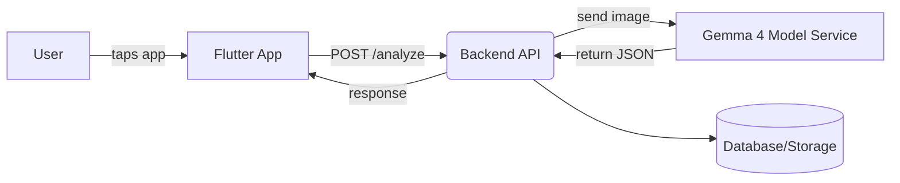
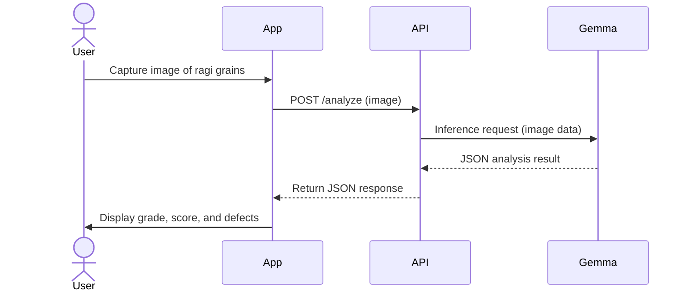

# System Architecture

## Overview

The system consists of:

- **Flutter Mobile App:** Captures images, calls API, displays results.
- **Backend API (FastAPI):** Receives images, interacts with AI model, processes results.
- **AI Model Service (Gemma 4):** Hosted in cloud (Vertex AI or container).
- **Data Storage (optional):** Save history logs or analytics.
  

- **User Workflow:** User captures a ragi image in the Flutter app. The app sends it to the FastAPI backend. The backend preprocesses and forwards it to the Gemma 4 model. The model returns analysis JSON, which the backend returns to the app for display.

## Deployment Options

We compare three main deployment strategies:

| Platform             | Description                                                    | Pros                                                           | Cons                                   |
|----------------------|----------------------------------------------------------------|----------------------------------------------------------------|----------------------------------------|
| **Vertex AI (GCP)**  | Managed ML service. Deploy Gemma 4 via Model Garden or custom. | Highly scalable, integrated GPUs/TPUs, auto-versioning. Secure (GCP compliance).【41†L102-L111】 | Vendor lock-in, cost management needed. May have quota limits. |
| **Cloud Run (GCP)**  | Serverless containers (with GPU).                            | Serverless scaling; pay-per-use; simple CI/CD. GPUs up to 96GB【41†L130-L139】. | Cold starts, limited to regions. May need GPU reservation. |
| **vLLM on Kubernetes** | Self-managed LLM serving (e.g. on GKE with vLLM).         | High throughput, memory-efficient inference【41†L153-L158】. Full control, custom hardware. | Complex setup (K8s operations), higher maintenance. |
| **Azure ML** (alt.)  | Azure’s ML deployment platform.                             | Similar managed experience on Azure; enterprise support.       | Learning curve, cost unknown (if needed). |

*(References: Gemma on GCP [Vertex AI, Cloud Run, GKE]【41†L130-L139】【41†L153-L158】.)*

## Sequence Diagram

## Infrastructure Notes

- **API Hosting:** We will likely use Cloud Run (for simplicity) or Vertex AI custom service. Database (e.g. Firestore) is optional for history.
- **Security:** API endpoints secured (API keys or Auth0).
- **Scaling:** Auto-scale on demand. Cold-start mitigation (warm pools) if needed.
  
---
